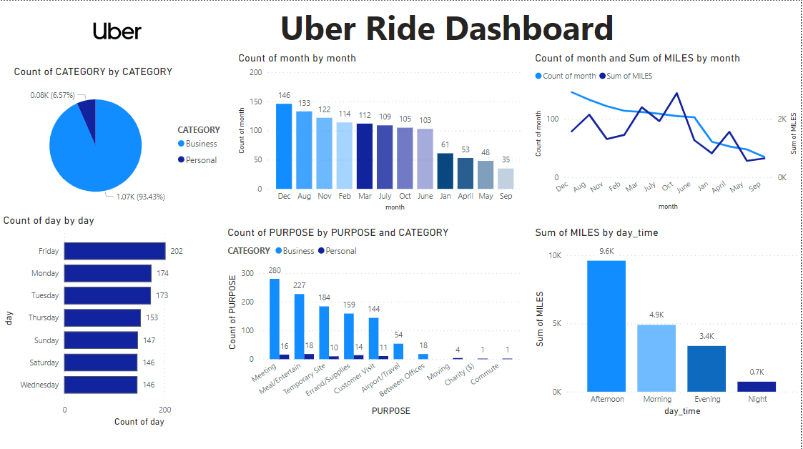

# Uber Ride Data Analysis 🚖

This project analyzes Uber ride data to uncover patterns in ride usage, including distributions across ride categories, purposes, months, days, and times. Insights are visualized through a dashboard to help make data-driven operational and business decisions.

## Features
- Data cleaning and preprocessing of raw Uber ride dataset
- Extraction of date, time, month, year, and trip duration from timestamps
- Visualization of ride patterns using count plots, bar charts, heatmaps, and distributions
- Dashboard summarizing key insights: ride distribution, miles traveled, and usage trends
- Recommendations for operational efficiency, marketing, and customer satisfaction

## Project Structure
| File | Description |
|------|-------------|
| `UberDataset.csv` | Raw Uber ride dataset |
| `UberDatasetCleaned.csv` | Cleaned and processed dataset |
| `Dashboard.png` | Visual dashboard summarizing analysis |
| `Uber_Rides_Data_Analysis_Documentation_and_Recommendations.docx` | Detailed analysis documentation and recommendations |

## Dashboard Insights
- Distribution of rides by **CATEGORY** (Business vs Personal)
- Ride trends by **Month** and total miles traveled
- Ride distribution by **Day of the Week**
- Purpose of rides categorized by **Business/Personal**
- Miles traveled during different times of day

## Recommendations
1. Optimize ride allocation during peak months
2. Target marketing campaigns by ride purpose
3. Improve service availability during peak hours
4. Monitor and reduce trip durations
5. Enhance service in high-demand categories
6. Offer seasonal promotions to boost ridership
7. Analyze high-mileage trips for operational improvements
8. Focus on popular routes and destinations
9. Integrate customer feedback for service enhancement
10. Implement driver training programs for consistent service quality

## How to Run
```bash
git clone https://github.com/rachitneedcse/Uber_Rides_Data_Anlysis.git
cd Uber-Rides-Data-Analysis
pip install -r requirements.txt
jupyter notebook Uber_Rides_Data_Analysis.ipynb

#Sample
